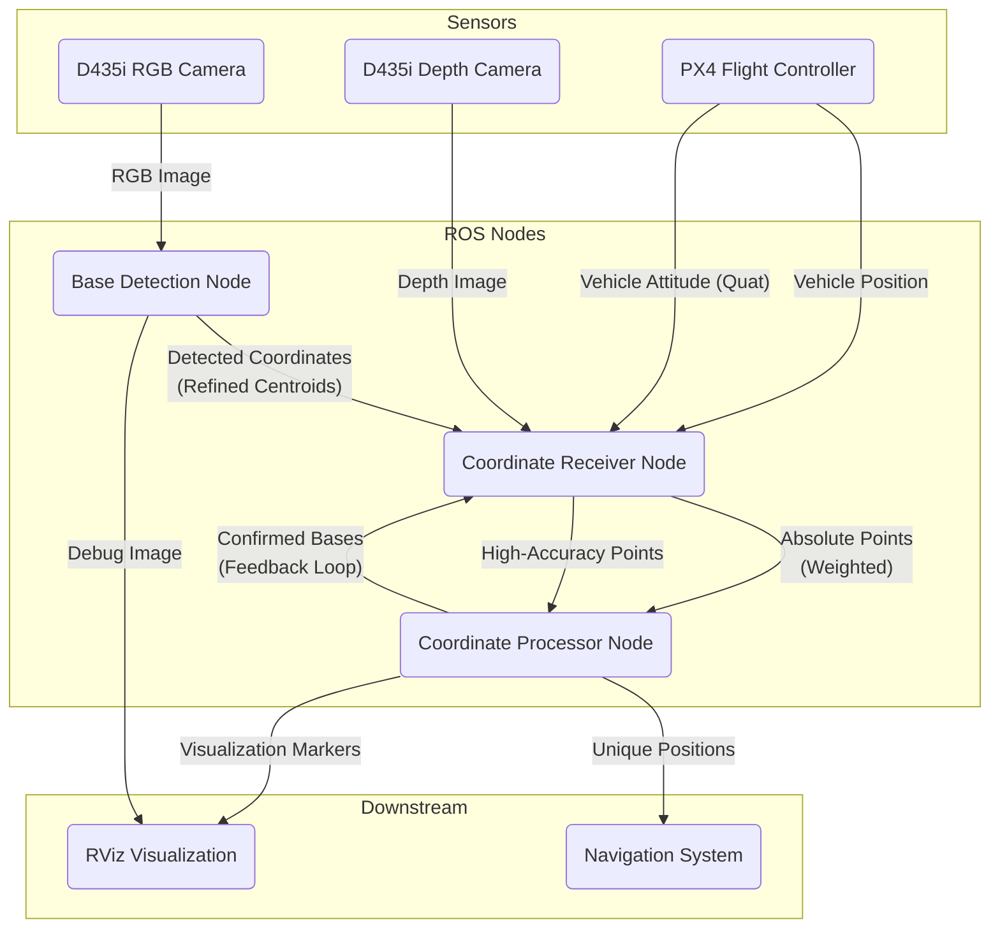
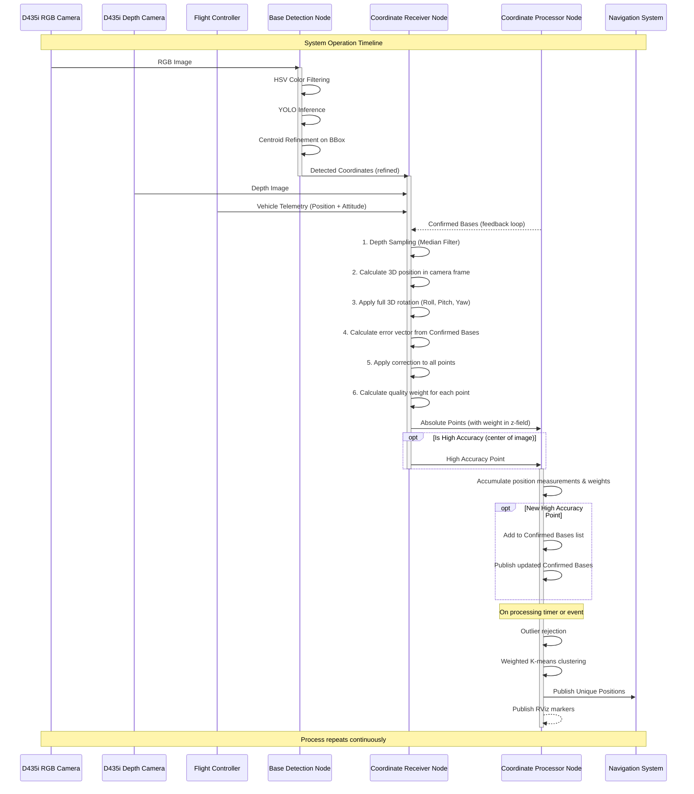

# Base Detection System


This repository contains a ROS2-based solution for autonomous base detection and high-precision localization, primarily for robotics competitions. The system uses an Intel RealSense D435i camera for depth sensing and a sophisticated computer vision pipeline to detect and calculate the precise positions of multiple bases in a competition arena.

## Repository Structure

```
/home/saraiva/pequi/uav_px4_simulator/ros_packages/base_detection
├── base_detection/   # Main Python package source code
│   ├── __init__.py
│   ├── base_detection.py       # Node for YOLO detection and centroid refinement
│   ├── clustering.py           # Clustering algorithms (K-Means, etc.)
│   ├── coordinate_processor.py # Node for clustering, state management, and feedback
│   ├── coordinate_receiver.py  # Node for 3D projection, rotation, and correction
│   ├── parameters.py           # ROS2 parameter declaration and management
│   ├── utils.py                # Utility functions (outlier removal, etc.)
│   ├── variables.py            # Central repository for topic names
│   └── visualization.py        # RViz marker management
├── config/             # YAML configuration files for nodes (Not yet used)
├── launch/             # ROS2 launch files to start the system nodes
├── resource/           # ament resource index
├── test/               # Unit and integration tests (Not yet implemented)
├── package.xml         # ROS2 package manifest
├── README.md           # This documentation file
└── setup.py            # Python package setup script
```

## System Architecture

The system is composed of three main ROS2 nodes that work in concert to transform raw sensor data into a stable, accurate map of base positions. It features advanced techniques such as centroid refinement, robust depth sampling, and a feedback loop for in-flight error correction.

### Component and Data Flow



### Data Processing Timeline



## Key Components

1.  **Base Detection Node**
    -   Processes RGB images from the D435i camera.
    -   Detects bases using a combination of HSV color filtering and a YOLO model.
    -   **Performs centroid refinement on detected bounding boxes for higher 2D accuracy.**
    -   Publishes the refined coordinates and a debug image for visualization.

2.  **Coordinate Receiver Node**
    -   Subscribes to detected coordinates, depth images, vehicle telemetry (position and attitude), and a feedback topic of confirmed bases. Its key responsibilities include:
        -   **Stabilizing depth readings** via neighborhood sampling (median filter).
        -   Projecting 2D detections into 3D points relative to the camera.
        -   **Applying full 3D rotation (roll, pitch, yaw)** to transform points into the world frame.
        -   **Calculating and applying a position correction vector** based on re-detected confirmed bases.
        -   **Assigning a quality weight** to each detection based on its distance from the image center.
        -   Publishing absolute 3D points (with weight embedded in the z-coordinate) and high-accuracy points.

3.  **Coordinate Processor Node**
    -   Acts as the system's memory and fusion center. It accumulates detections over time to produce a stable map of the bases. Its key responsibilities include:
        -   **Managing a list of high-certainty "confirmed bases"**.
        -   **Publishing the list of confirmed bases** as a feedback loop to the `CoordinateReceiver`.
        -   Performing outlier rejection on accumulated points.
        -   **Using a weighted K-Means algorithm** to find cluster centers, giving more importance to high-quality detections.
        -   Publishing the final, unique base positions for the navigation system and for RViz visualization.


## ROS2 Topic Structure

### Primary Topics
-   `base_detection/detected_coordinates` (`Float32MultiArray`): Publishes the refined 2D coordinates `[x1, y1, x2, y2, score]` of each detection.
-   `base_detection/absolute_points` (`Point`): Publishes the calculated 3D position of each base after rotation and correction. **The `z` field is used to carry the detection's quality weight (0.0 to 1.0).**
-   `base_detection/high_accuracy_point` (`Point`): Publishes the position of a base when it is detected in the center of the image, used to create a "confirmed base".
-   `base_detection/unique_positions` (`PoseArray`): Publishes the final, stable positions of all unique bases found by the system. This is the primary output for a navigation system.
-   `base_detection/confirmed_bases` (`PoseArray`): The feedback topic used by the `CoordinateProcessor` to send the current list of known bases back to the `CoordinateReceiver` for error correction.

### Sensor and Telemetry Inputs
-   `/camera/color/image_raw` (`Image`): RGB image from the camera.
-   `/camera/depth/image_rect_raw` (`Image`): Depth image from the camera.
-   `/fmu/out/vehicle_local_position` (`VehicleLocalPosition`): Used for vehicle position (x,y,z) and velocities.
-   `/fmu/out/vehicle_attitude` (`VehicleAttitude`): **Used for complete 3D orientation (quaternion) to correct for roll and pitch.**

### Visualization Topics
-   `base_detection/inferred_image` (`Image`): The input image with detections, centroids, and bounding boxes drawn on it.
-   `base_detection/visualization_markers` (`MarkerArray`): Publishes various markers (raw points, cluster centers, ground truth) for visualization in RViz.

## Setup and Installation

Se necessario, acesse o PC da Telma primeiro:

ssh flying@200.137.220.91 -p 22454

**jetson fica sempre da pqmec-galaxy**
```bash
ssh -XC orin2@172.16.2.233
senha: orin2

cd bringup 
docker compose up (as vezes vc usa o do tmp)

ros2 topic list

rviz

docker exec -it base_detection_container bash

ls
cd ros2_ws/src/base_detection
ros2 topic list
```
1. **Prerequisites**

   ```bash
   # Install ROS2 dependencies
   sudo apt install ros-<distro>-cv-bridge
   sudo apt install ros-<distro>-sensor-msgs

   # Install Python dependencies
   pip install numpy opencv-python
   ```
2. **Clone the Repository**

   ```bash
   git clone https://github.com/yourusername/base_detection.git
   cd base_detection
   ```
3. **Build the Package**

   ```bash
   colcon build
   source install/setup.bash
   ```

## Running the System

1. **Launch the Camera**

   ```bash
   ros2 launch realsense2_camera rs_launch.py
   ```
2. **Start Base Detection**

   ```bash
   ros2 run base_detection base_detection.py
   ```
3. **Start Coordinate Processing**

   ```bash
   ros2 run base_detection coordinate_receiver.py
   ```

## Testing and Validation

### Unit Testing

1. Test base detection accuracy:
   ```bash
   ros2 run base_detection test_detection.py
   ```

### System Validation

1. **Static Testing**

   - Place a known base at measured coordinates
   - Compare system output with ground truth
   - Verify depth calculations
2. **Dynamic Testing**

   - Test system with moving base
   - Validate coordinate tracking
   - Check failsafe triggers

### Safety Features

- Altitude failsafe trigger at -0.13m
- Bounding box validation with 10% tolerance
- Depth value sanity checks

## Troubleshooting

Common issues and solutions:

1. Invalid depth values

   - Check camera alignment
   - Verify lighting conditions
   - Ensure proper camera calibration
2. Coordinate misalignment

   - Verify camera intrinsic parameters
   - Check bias values (current: x=0.1, y=0.1)
   - Validate RGB-D alignment

## Contributing

1. Fork the repository
2. Create your feature branch
3. Commit your changes
4. Push to the branch
5. Create a new Pull Request

## License

This project is licensed under the MIT License - see the `LICENSE` file for details (if available), or refer to the standard MIT License text.
