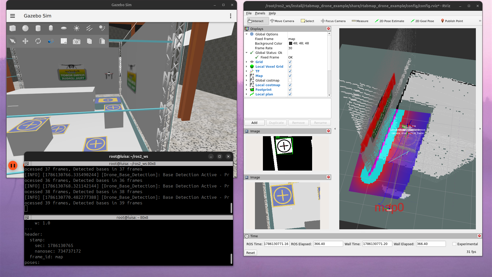

# Rodar simulação + base_detection

Pacote ROS 2 (Humble) que detecta as bases de pouso pela câmera de baixo do
drone `hermit` e publica a posição `[x, y, z]` de cada base no frame `map`
(o mesmo referencial em que a posição do drone é rastreada). Ele não roda
sozinho — precisa ser copiado pro workspace ROS 2 do simulador
[`uav_px4_simulator`](https://github.com/FlyingRobots-Pequi/uav_px4_simulator).

## Como funciona: da detecção ao [x, y, z]

**Sem câmera de profundidade** — só a RGB da câmera de baixo (`/camera/down/image`)
e os intrínsecos dela (`/camera/down/camera_info`, lidos uma vez). A posição
3D vem de cruzar o raio da câmera com o plano do chão (assume que a base
está no nível do chão — correto pra pouso, não serve pras bases elevadas).
Passo a passo (tudo em `base_detection/base_detection.py`, no callback
`_inferenzzia` + `get_points_to_3d`):

1. **Detecção (imagem → pixel da base)** — a imagem RGB passa por um filtro
   HSV que isola as cores da base; o resultado vira uma máscara
   preto-e-branco onde o YOLO (`best.pt`) roda a inferência. Pra cada
   detecção com score > 0.9, o centro da bounding box é refinado pro
   centroide da máscara HSV dentro da box — isso dá o pixel `(u, v)` do
   centro da base.

2. **Raio da câmera (pixel → direção 3D)** — com os intrínsecos (fx, fy, cx,
   cy), o modelo pinhole converte o pixel `(u, v)` numa direção no frame
   óptico da câmera (`camera_down_optical_frame`): `x = (u - cx)/fx`,
   `y = (v - cy)/fy`, `z = 1` — sem profundidade, é só a direção do raio.

3. **Raio pro frame do mundo (TF2)** — a origem da câmera e um ponto ao
   longo do raio são transformados pro frame `map` via TF2, usando a cadeia
   `map ← base_link ← camera_down_optical_frame`. A TF estática da câmera
   (posição/orientação dela no corpo do drone) vem do launch do simulador, e
   a `map ← base_link` (onde o drone está no mundo, com toda a
   atitude/posição real) vem do RTAB-Map — sem trigonometria manual de
   heading no código.

4. **Interseção com o chão (Z=0)** — já no frame `map`, calcula-se o `t` que
   faz o raio cruzar `Z=0` e resolve `X, Y` nesse ponto. Se o raio não
   aponta pro chão (atitude estranha) ou o `t` sair negativo, a detecção é
   descartada.

5. **Rastreamento (várias leituras → uma base)** — cada ponto novo é
   comparado com as bases já conhecidas pela distância XY: se está a menos
   de 1 m de uma existente, é a mesma base e a posição é suavizada
   (média exponencial `0.8·antiga + 0.2·nova`); senão, é registrada como
   base nova. A lista completa é publicada em `/base_detection/bases`
   (`PoseArray`, frame `map`) a cada atualização.

Como o passo 3 depende do TF2, o **Terminal 2** (que publica essas TFs)
precisa estar de pé e com o `map → base_link` já disponível
(RTAB-Map/localização inicializados) antes do `base_detection` conseguir
publicar posições. Se aparecer `TF map<-camera_down_optical_frame
indisponível` no log do Terminal 4, é isso — espera o Terminal 2/3
estabilizarem.

## Pré-requisito na simulação

⚠️ Rodar o `uav_px4_simulator` na branch `feat/base-detection` (é lá que
está o `Dockerfile.base_detection`, com as libs de Python que o
`base_detection` precisa). Essa branch também tem um sensor
`downward_depth_camera` no `hermit/model.sdf` (+ bridge `/camera/down/depth`)
mantido pra uso futuro, mas o `base_detection` **não usa** ele hoje — a
posição 3D é calculada só com a RGB (ver seção abaixo). Numa cópia
nova/desatualizada:

```bash
git checkout feat/base-detection
git pull
git submodule update --init --recursive
```

## Comandos

Antes de tudo, copiar o pacote pro workspace do simulador (uma vez, ou toda
vez que mudar o código):

```bash
rsync -a --exclude='.git' base_detection/ uav_px4_simulator/ros_packages/base_detection/
```

## Abrir os terminais

Buildar a imagem `base_detection` uma vez (a imagem base já precisa existir,
via `./build.sh` no `uav_px4_simulator`):

```bash
cd uav_px4_simulator
./build_base_detection.sh
```
Isso abre o Terminal 1 — **precisa passar a tag**, senão sobe a imagem
padrão (sem as libs do `base_detection`) e o Terminal 4 vai dar
`ModuleNotFoundError: No module named 'ultralytics'`:

```bash
IMAGE_NAME=uav-px4-simulator-local:base_detection ./run.sh
```

Pra conferir se o container subiu com a imagem certa:

```bash
docker ps --filter name=px4_container --format '{{.Image}}'
```

Tem que mostrar `uav-px4-simulator-local:base_detection`. Se mostrar
`victormatteus04/uav-px4-simulator-1.15.3:latest`, o `./run.sh` rodou sem a
tag — para o container (`docker stop px4_container`) e sobe de novo com o
`IMAGE_NAME=...` acima.

Já dentro do container executar:

```bash
cd /root/ros2_ws
colcon build --symlink-install
source install/setup.bash
```

Abrir mais **4 terminais** com:

```bash
docker container exec -it px4_container bash
source /root/ros2_ws/install/setup.bash
```

Se der `Package 'rtabmap_drone_example' not found` em alguma etapa, o
`colcon build` falhou — olha o erro real rodando ele nesse mesmo terminal
de novo (`cd /root/ros2_ws && colcon build --symlink-install`). Duas causas
já vistas:

- **`ament_cmake`/`Findament_cmake.cmake` não encontrado**: o ROS Humble não
  estava carregado nesse shell antes do build (`source /opt/ros/humble/setup.bash`,
  normalmente automático via `.bashrc` — confira se não pulou).
- **`TypeError: canonicalize_version() got an unexpected keyword argument
  'strip_trailing_zero'`** (falha no `base_detection`): `setuptools`/`packaging`
  desalinhados — já corrigido no `Dockerfile.base_detection` (fixa
  `setuptools<80` e `packaging>=22` depois do `ultralytics`), mas se pegar
  uma imagem buildada antes dessa correção, resolve na mão:
  ```bash
  pip install "setuptools<80" "packaging>=22"
  ```


## Terminal 1 — simulação

```bash
USE_WAREHOUSE=1 simulation.sh
```

## Terminal 2 — bridge + RTAB-Map + Nav2 + RViz

```bash
ros2 launch rtabmap_drone_example ros2_bridge.launch.py world:=arena_warehouse
```

## Terminal 3 — arma e decola

```bash
ros2 run rtabmap_drone_example offboard_control --ros-args -r __ns:=/pequi/hermit -p use_sim_time:=true
```

## Terminal 4 — base_detection

As libs de Python (`ultralytics`, `numpy<2`, remoção do `opencv-python`) já
vêm prontas se o container foi aberto com a imagem `base_detection`. O
`colcon build` já compilou esse pacote junto com o resto — só precisa rodar de novo se você editar o `.py` depois disso:

```bash
cd /root/ros2_ws && colcon build --symlink-install --packages-select base_detection
```

Rodar:

```bash
source /root/ros2_ws/install/setup.bash
ros2 run base_detection base_detection --ros-args \
  -r /fmu/out/vehicle_local_position:=/pequi/hermit/fmu/out/vehicle_local_position
```

## Terminal 5 — conferir as bases detectadas

```bash
source /root/ros2_ws/install/setup.bash
ros2 topic echo /base_detection/bases
```

## No RViz

Pra ver a câmera e a detecção: `Add` → `By topic` → escolher cada um:

- `Camera` → `/camera/down/image` (câmera de baixo, crua)
- `Image` → `/base_detection/debug_image` (máscara HSV + bounding box)
- `PoseArray` → `/base_detection/bases` (posição das bases detectadas)

Ficará assim:

