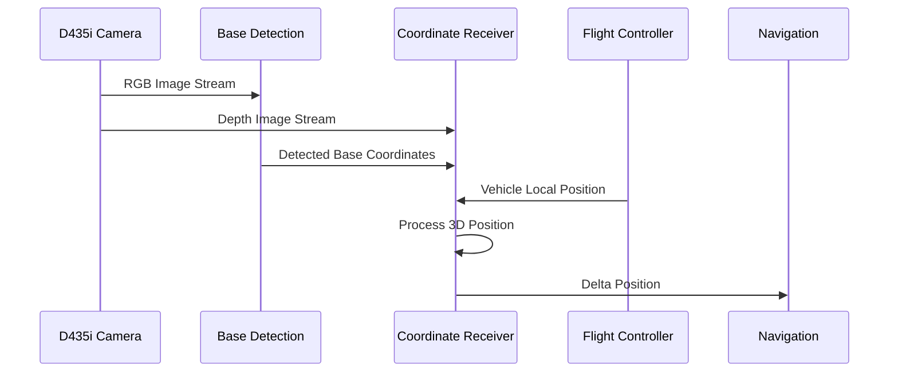

# Base Detection System

This repository contains a ROS2-based solution for autonomous base detection in robotics competitions. The system uses Intel RealSense D435i camera for depth sensing and computer vision to detect and calculate precise positions of bases in the competition arena.

## System Architecture

### Component Overview


### Data Flow



## Key Components

1. **Base Detection Node**
   - Processes RGB images from D435i camera
   - Detects bases using computer vision
   - Publishes detected coordinates

2. **Coordinate Receiver Node**
   - Subscribes to:
     - Detected coordinates
     - Depth images
     - Vehicle local position
   - Processes 3D position calculations
   - Handles coordinate transformations
   - Publishes delta positions for navigation

3. **Camera System**
   - Uses Intel RealSense D435i
   - Provides RGB and depth data
   - Camera Parameters:
     - Focal Length: 925.1 pixels
     - Principal Point: (639.5, 359.5)
     - Baseline: 0.025m

## ROS2 Topic Structure

- `/detected_coordinates` (Float32MultiArray): Base detection coordinates
- `/hermit/camera/d435i/depth/image_rect_raw` (Image): Depth image data
- `/fmu/out/vehicle_local_position` (VehicleLocalPosition): Current vehicle position
- `/delta_position` (Point): Processed position delta

## Setup and Installation

1. **Prerequisites**
   ```bash
   # Install ROS2 dependencies
   sudo apt install ros-<distro>-cv-bridge
   sudo apt install ros-<distro>-sensor-msgs
   
   # Install Python dependencies
   pip install numpy opencv-python
   ```

2. **Clone the Repository**
   ```bash
   git clone https://github.com/yourusername/base_detection.git
   cd base_detection
   ```

3. **Build the Package**
   ```bash
   colcon build
   source install/setup.bash
   ```

## Running the System

1. **Launch the Camera**
   ```bash
   ros2 launch realsense2_camera rs_launch.py
   ```

2. **Start Base Detection**
   ```bash
   ros2 run base_detection base_detection.py
   ```

3. **Start Coordinate Processing**
   ```bash
   ros2 run base_detection coordinate_receiver.py
   ```

## Testing and Validation

### Unit Testing
1. Test base detection accuracy:
   ```bash
   ros2 run base_detection test_detection.py
   ```

### System Validation
1. **Static Testing**
   - Place a known base at measured coordinates
   - Compare system output with ground truth
   - Verify depth calculations

2. **Dynamic Testing**
   - Test system with moving base
   - Validate coordinate tracking
   - Check failsafe triggers

### Safety Features
- Altitude failsafe trigger at -0.13m
- Bounding box validation with 10% tolerance
- Depth value sanity checks

## Troubleshooting

Common issues and solutions:
1. Invalid depth values
   - Check camera alignment
   - Verify lighting conditions
   - Ensure proper camera calibration

2. Coordinate misalignment
   - Verify camera intrinsic parameters
   - Check bias values (current: x=0.1, y=0.1)
   - Validate RGB-D alignment

## Contributing

1. Fork the repository
2. Create your feature branch
3. Commit your changes
4. Push to the branch
5. Create a new Pull Request
